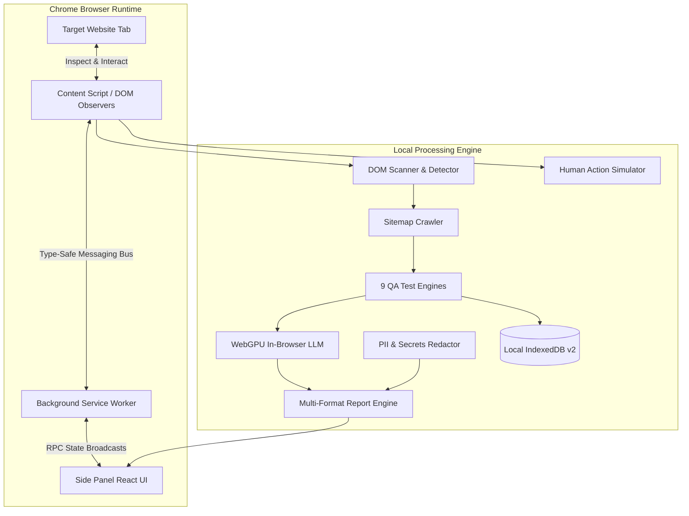

# Autonomous AI Website QA Agent

<div align="center">


-success?style=for-the-badge&logo=vitest)


**A production-grade, local-first Chrome Extension that autonomously explores websites, plans targeted tests, executes actions, monitors telemetry, reasons on defects with in-browser WebGPU LLMs, and generates multi-format executive audit reports.**

</div>

---

## 📑 Table of Contents

- [Overview](#-overview)
- [System Architecture](#-system-architecture)
- [Core Features](#-core-features)
- [Deterministic QA Modules](#-deterministic-qa-modules)
- [Local AI & WebGPU Engine](#-local-ai--webgpu-engine)
- [Safety & Privacy Hardening](#-safety--privacy-hardening)
- [Installation & Quickstart](#-installation--quickstart)
- [User Guide](#-user-guide)
- [Development & Verification](#-development--verification)
- [Distribution Packaging](#-distribution-packaging)
- [Database Schema](#-database-schema)
- [License](#-license)

---

## 🚀 Overview

The **Autonomous AI Website QA Agent** transforms manual browser QA into a deterministic, AI-arbitrated automated audit. Docked inside Chrome's native **Side Panel**, the extension interacts with active web applications in real time without requiring external test drivers (like Selenium or Playwright) or sending confidential application code to external cloud providers.

```
Any Website
    │
    ▼
Chrome Extension ON (Side Panel)
    │
    ▼
[ "Start Full QA" ]
    │
    ▼
┌──────────────┐     ┌──────────────┐     ┌──────────────┐     ┌──────────────┐
│ 1. DISCOVER  │ ──> │   2. PLAN    │ ──> │  3. EXECUTE  │ ──> │  4. OBSERVE  │
│ DOM & Routes │     │ Test Matrix  │     │ Safe Actions │     │ Net & Errors │
└──────────────┘     └──────────────┘     └──────────────┘     └──────────────┘
                                                                       │
                                                                       ▼
┌──────────────┐     ┌──────────────┐     ┌──────────────┐     ┌──────────────┐
│  7. REPORT   │ <── │  6. VERIFY   │ <── │  5. REASON   │ <── │ 5. DETECT    │
│ HTML/PDF/JSON│     │ Deterministic│     │ WebGPU / AI  │     │ Bugs & Flaws │
└──────────────┘     └──────────────┘     └──────────────┘     └──────────────┘
    │
    ├─► Download Clean HTML (Print-Ready CSS)
    ├─► Download GFM Markdown (GitHub / Jira)
    ├─► Download Schema-Valid JSON (CI/CD)
    └─► Share Online (Optional Supabase Sync)
```

---

## 🏗️ System Architecture

The extension is structured around Manifest V3 best practices, separating concerns across background service workers, isolated content scripts, and high-performance React UI side panels:



---

## ✨ Core Features

1. **Native Chrome Side Panel**: Docked side-by-side with target pages; never obscures application viewport or overlaps UI controls.
2. **Autonomous Exploration & Discovery**: Generates deterministic, stable CSS selectors (`#id`, `[data-testid]`, `tag[name]`, hierarchical `:nth-of-type`) and identifies internal vs external navigation boundaries.
3. **SPA Route Change Hook**: Intercepts `history.pushState`, `history.replaceState`, `popstate`, and `hashchange` to support dynamic React, Vue, Angular, and Next.js applications.
4. **RFC 2606 Synthetic Identities**: Automatically populates form controls using non-resolving test emails (`qa-test@example.invalid`), safe telephone numbers, and dummy passwords.
5. **DPR-Aware Visual Crop Highlights**: Generates exact pixel highlights and element-cropped screenshots with device-pixel-ratio compensation.
6. **Optional Supabase Cloud Integration**: Zero-dependency cloud publishing client for uploading report documents, persisting database summaries, and generating team sharing URLs.

---

## 🔍 Deterministic QA Modules

The agent orchestrates 9 specialized, rule-based QA inspection modules:

| QA Module | Checks Performed | Severity Range |
|---|---|:---:|
| **Link Tester** | Empty `href`s, dead `#` anchors, deprecated `javascript:` pseudo-protocols, external routing | Low to Medium |
| **Button Tester** | Unlabeled controls (no text, no `aria-label`), disabled states, high-risk actions | Info to High |
| **Form Tester** | Missing submit triggers, unlabeled inputs, missing `<label for>` attributes | High |
| **Console Tester** | Uncaught runtime exceptions, syntax errors, and uncaught Promise rejections | High to Critical |
| **Network Tester** | HTTP 4xx client errors, HTTP 5xx server faults, and blocked network requests | High to Critical |
| **SEO Tester** | Title length (< 10 or > 70 chars), meta descriptions, single `<h1>` hierarchy, canonical tags, OpenGraph | Low to Medium |
| **Accessibility** | Root `<html lang>`, image `alt` tags, empty `alt` on non-decorative images, ambiguous links ("Click here") | Medium to High |
| **Responsive** | Mobile viewport tags (`width=device-width`), viewport responsiveness across 6 device presets | Medium to Critical |
| **Performance** | High DOM interactive density (> 250 controls), oversized unoptimized images (> 1800px) | Low to Medium |

---

## 🧠 Local AI & WebGPU Engine

The extension integrates in-browser machine learning using `@mlc-ai/web-llm`:
- **Hardware Tier Detection**: Detects device GPU capabilities (`FULL_WEBGPU`, `LIGHT_WEBGPU`, or `UNSUPPORTED`) via `navigator.gpu`.
- **Private & Client-Side**: Models (e.g. `SmolLM2-360M`, `Qwen2.5-0.5B`) run locally inside WebGPU VRAM. No external LLM keys or network calls are required.
- **Smart Heuristic Fallback**: If WebGPU is unavailable or VRAM is limited, the agent falls back instantly to deterministic heuristics without interruption.
- **Model VRAM Management**: Instant load, unload, and CacheStorage eviction to minimize system memory impact.

---

## 🛡️ Safety & Privacy Hardening

### 1. High-Risk Action Gate
Automated interactions that could incur real-world costs or state changes (e.g., checkout, order submission, payments, user account deletion, password changes) are classified as **HIGH RISK**. The agent automatically pauses execution and displays an **Approval Banner** in the Side Panel, requiring explicit user authorization (`approvedByUser: true`) before clicking.

### 2. Zero-PII & Secrets Redaction
All captured console logs, network headers, failure payloads, and DOM snippets pass through a centralized regex redactor (`src/shared/security/redactor.ts`):
- **Credit Cards**: Luhn-pattern credit card numbers are masked as `[REDACTED_CARD: ****-1234]`.
- **SSNs**: Formatted and raw SSNs are replaced with `[REDACTED_SSN]`.
- **API Keys**: OpenAI (`sk-...`), GitHub (`ghp_...`), AWS (`AKIA...`), and generic Bearer tokens are masked.
- **Sensitive URLs**: Query parameters matching `token`, `password`, `secret`, `apiKey`, `auth` are replaced with `[REDACTED_SECRET]`.
- **Circular Reference Guard**: Recursive deep object sanitizer with `WeakSet` guard.

---

## 📦 Installation & Quickstart

### Prerequisites
- Node.js 18+ and npm
- Google Chrome or any Chromium-based browser (Edge, Brave, Arc)

### Step 1: Clone & Install Dependencies
```bash
git clone https://github.com/your-repo/ai-website-qa-agent.git
cd ai-website-qa-agent
npm install
```

### Step 2: Build the Extension
```bash
npm run build
```
This compiles the production bundle into the `dist/` directory.

### Step 3: Load into Chrome
1. Open Google Chrome and navigate to `chrome://extensions/`.
2. Enable **Developer mode** toggle in the top-right corner.
3. Click **Load unpacked**.
4. Select the `dist/` directory from this project.
5. The **AI Website QA Agent** icon will appear in your extension toolbar.

---

## 📖 User Guide

1. **Open Target Website**: Navigate to any web application or site you want to inspect.
2. **Launch Side Panel**: Click the AI Website QA Agent extension icon. The agent docks into Chrome's native Side Panel.
3. **Configure Options**: Set crawl depth, page limits, and enable/disable specific QA modules in the **Settings** tab.
4. **Start Audit**: Click **"Start Full QA"** on the Dashboard.
5. **Observe Real-Time Execution**:
   - The agent scans the DOM, crawls internal routes, executes simulated interactions, and captures telemetry.
   - If high-risk actions (e.g., checkout/deletion) are encountered, click **"Approve"** or **"Skip"** in the approval banner.
6. **Review Findings**: Inspect detected defects categorized by severity (`CRITICAL`, `HIGH`, `MEDIUM`, `LOW`, `INFO`) in the **Findings** tab.
7. **Export & Share**:
   - **Download HTML**: Self-contained report with print stylesheets (`Ctrl+P` ready).
   - **Download Markdown**: Ready for pasting directly into GitHub issues or Jira.
   - **Download JSON**: Machine-readable schema for CI/CD audit gates.
   - **Share Online (Optional)**: If Supabase is configured, upload and generate a public shareable URL.

---

## 🛠️ Development & Verification

The project enforces strict code quality gates:

```bash
# Run unit and end-to-end integration tests (160 tests across 38 suites)
npm test

# Run strict TypeScript compiler verification
npm run typecheck

# Build optimized production bundle
npm run build

# Package distribution archive for Chrome Web Store
npm run package
```

---

## 📦 Distribution Packaging

To generate a Chrome Web Store distribution package:
```bash
npm run package
```
The script validates the presence of all required Manifest V3 assets and outputs `dist/ai-website-qa-agent-v1.0.0.zip` ready for upload to the **Chrome Web Store Developer Dashboard**.

---

## 🗄️ Database Schema

The agent operates a local-first **IndexedDB** database (`ai_qa_agent_db` v2) with 8 typed object stores:

| Object Store | Key Path | Primary Indexes | Description |
|---|---|---|---|
| `sessions` | `id` | `startTime` | Audit session records, target URL, and execution stats |
| `findings` | `id` | `sessionId`, `severity`, `status` | Detected issues, evidence traces, and recommendations |
| `projects` | `id` | `origin` | Website domain audit history and aggregate scores |
| `logs` | `id` | `sessionId`, `timestamp` | Sanitized diagnostic and execution logs |
| `settings` | `key` | None | User preferences, privacy mode, and cloud credentials |
| `reports` | `id` | `sessionId` | Synthesized report documents |
| `page_snapshots` | `url` | `timestamp` | Full structural DOM inventory snapshots |
| `discovery_maps` | `sessionId` | None | Aggregated site routes and element inventories |

---

## 📄 License

MIT License &copy; 2026 AI Website QA Agent Contributors.
